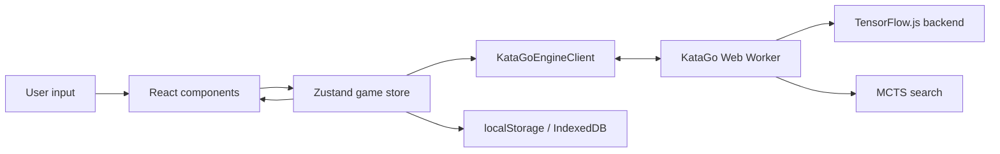

# Architecture

Web KaTrain is a single-page React app with a local analysis engine. The UI and
game state live on the main thread. KataGo model loading, neural network
inference, and MCTS run inside a dedicated Web Worker so the board remains
responsive during analysis.

## Runtime Overview

## Main Thread

The main thread owns the user experience:

- `src/main.tsx` installs error handlers, registers the production service
  worker, schedules production update checks, and mounts React.
- `src/App.tsx` is the top-level app component.
- `src/components/Layout.tsx` coordinates the desktop/mobile layouts, modal
  surfaces, drag and drop, command palette, keyboard shortcuts, gamepad
  navigation, photo board import, and store actions.
- Feature components such as `GoBoard`, `MoveTree`, `AnalysisPanel`,
  `GameReportModal`, `LibraryPanel`, `SettingsModal`, and `PhotoBoardModal`
  render focused parts of the app.

The React components should not talk to the worker directly. They read state and
call actions from `useGameStore`.

## Game Store

`src/store/gameStore.ts` is the application core. It combines:

- The current board, player to move, captures, komi, and rules.
- A tree of `GameNode` objects, where each node owns its move, resulting
  `GameState`, SGF properties, notes, optional end state, and optional analysis.
- UI modes such as analysis, continuous analysis, teach mode, insert/edit mode,
  region of interest selection, AI play, and game analysis progress.
- Settings, including model URL, TensorFlow.js backend preference, visits,
  board theme, locale, timer settings, trainer thresholds, and AI strategy.
- Persistence hooks for settings, library state, current-game auto-save, and
  uploaded model state.

Analysis results are attached to game-tree nodes. That lets branches keep their
own cached analysis and makes SGF export able to include the analysis associated
with each position.

## Engine Boundary

`src/engine/katago/client.ts` creates a singleton `Worker` for
`src/engine/katago/worker.ts`. The client exposes three async operations:

- `init`: load a model and backend before analysis.
- `analyze`: run MCTS and return move candidates, root values, policy, and
  ownership.
- `evaluate` / `eval_batch`: run value-only inference for quick game scans.

The worker protocol is defined in `src/engine/katago/types.ts`. Messages are
plain serializable objects so they can cross the worker boundary with
`postMessage`.

Inside the worker, requests are serialized through a promise queue. Interactive
analysis can supersede older interactive work, and background work is tracked
separately by group.

## Analysis Queue

`src/utils/analysisQueue.ts` sits above the engine client on the main thread. It
adds:

- Priority ordering for interactive, AI move, self-play, and game-analysis jobs.
- Cancellation by group.
- Stale result detection.
- A bounded in-memory result cache.

The store uses this queue for continuous analysis, AI moves, quick/fast/full
game analysis, and self-play.

## Storage

Web KaTrain uses browser storage only:

- Settings are stored in `localStorage` under versioned keys.
- The game library lives in IndexedDB database `web-katrain-library`, with a
  localStorage fallback.
- Uploaded model weights can be stored in IndexedDB database
  `web-katrain-models`.
- Auto-save stores the active game for crash or reload recovery.
- The production service worker caches the app shell, default model, WASM
  binaries, icons, and board assets.

No server-side persistence exists.

## Data Formats

- SGF import/export is handled by `src/utils/sgf.ts`.
- KaTrain-style `KT` analysis data is encoded and decoded by
  `src/utils/katrainSgfAnalysis.ts`.
- Kaya-style `KA` analysis data is encoded and decoded by
  `src/utils/kayaSgfAnalysis.ts`.
- Online-Go links are resolved through `src/utils/ogs.ts`.

## Project Invariants

- Supported board sizes are 9, 13, and 19.
- Analysis values are stored from Black's perspective: `rootWinRate` is Black
  win probability and `rootScoreLead` is Black score lead.
- Worker messages must remain serializable.
- Model URLs are normalized before fetch so deployed base paths work.
- Do not bypass the store for game-tree mutation; UI should call store actions.
