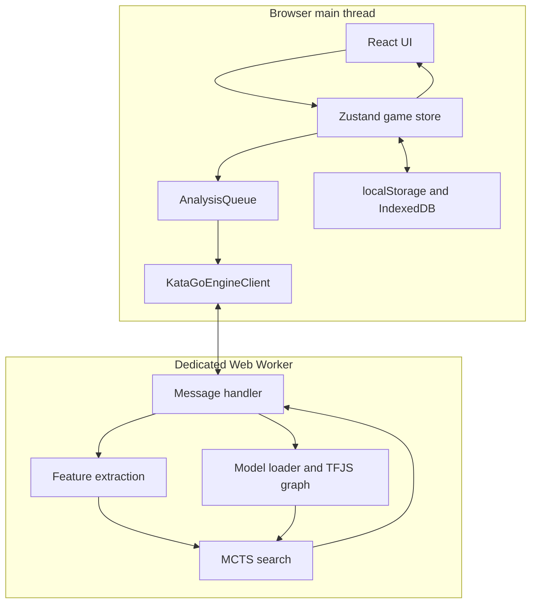
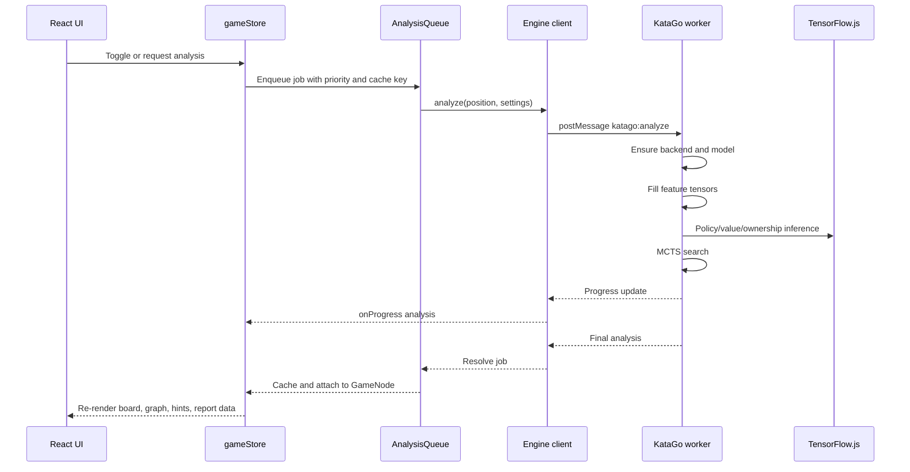
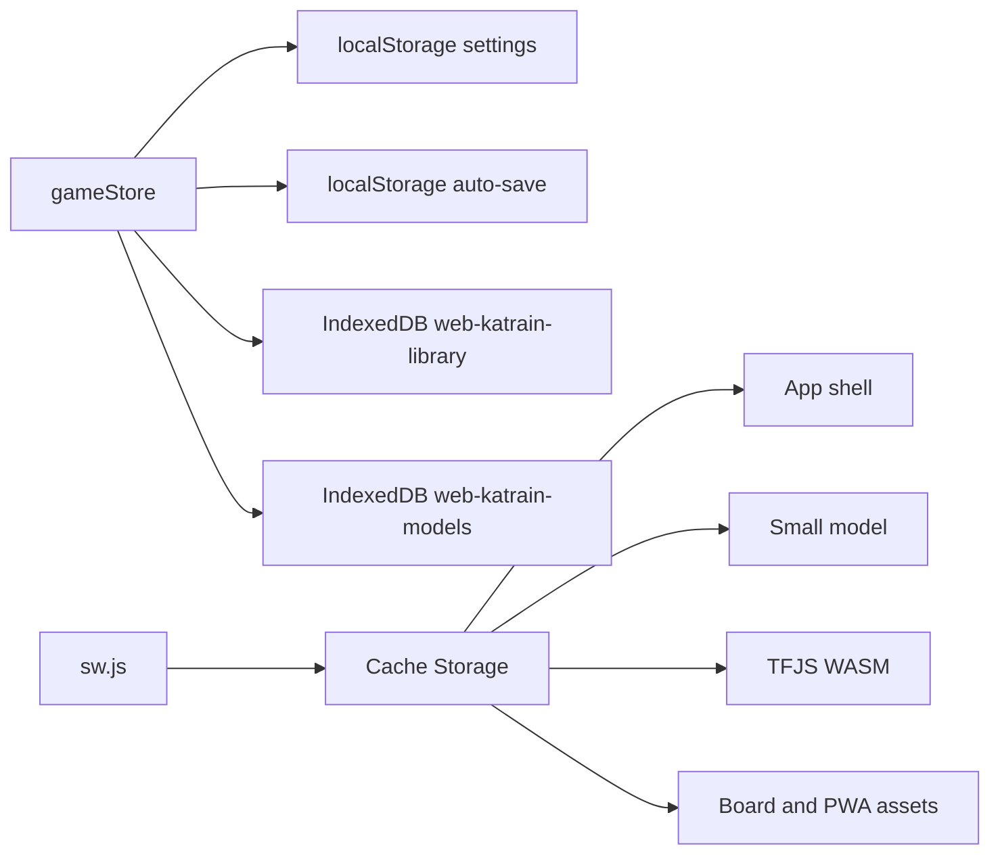

# Runtime Diagrams

These diagrams are intentionally compact. See [Architecture](architecture.md)
and [Engine](engine.md) for the detailed narrative.

## App and Engine

## Analysis Request

## Persistent Data

